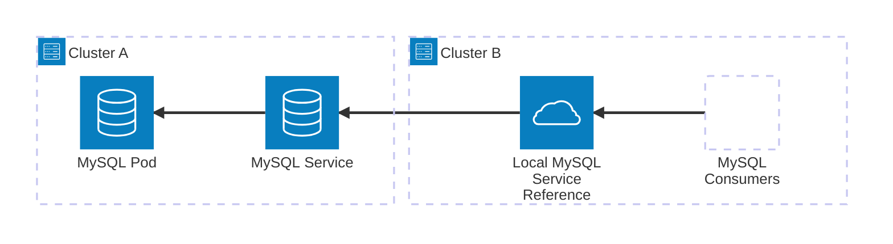
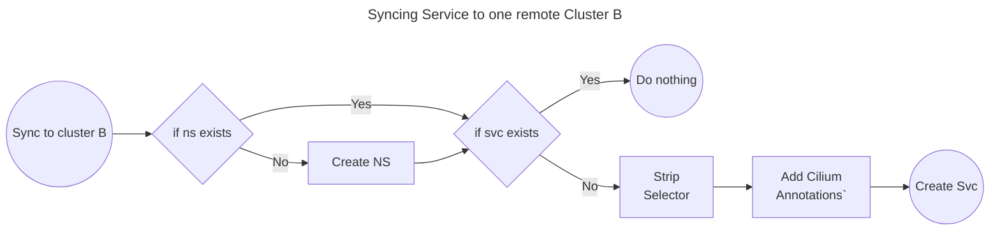
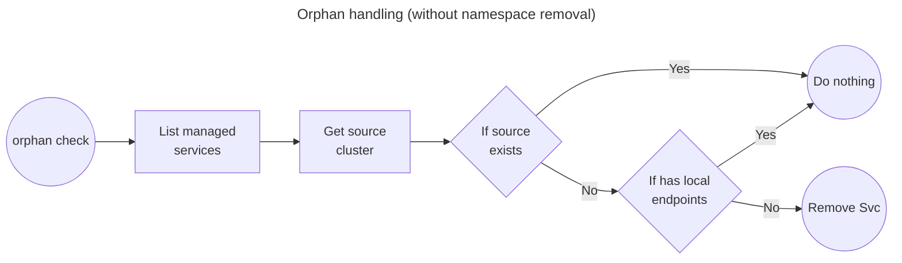

# Service Synchronization with Keess

The purpose of this feature is to facilitate exposing a service in one cluster to other clusters, using Cilium Global Services, available on PAC-v2 clusters.

## Context

When you use [Cilium](https://docs.cilium.io/en/latest/overview/intro/) CNI in multiple related Kubernetes Clusters, you can use its ClusterMesh features to extend networking across them.

When using a ClusterMesh, you cant load balance Kubernetes services over the clusters, or **expose a service on one cluster as a local service on the other ones**. Is this later use case that this Keess feature targets, to make it easier for our users to configure such service exposure across clusters.

Cilium enables that through the concept of [Global Services](https://docs.cilium.io/en/latest/network/clustermesh/services/#load-balancing-with-global-services). They are primarily made to balance across service instances deployed to many clusters. It will expose the remote endpoints inside each cluster's local service.

But we can use it to access remote services like they were local, without needing to configure nodePort or ingress to get to the other cluster service.



In the example above, there are no MySQL instances on cluster B. The "Local MySQL Service Reference" is a Kubernetes Service acting like a _passthrough_ to the service in cluster A.

Here is a trimmed down Service definition for cluster A:

```yaml
apiVersion: v1
kind: Service
metadata:
  name: mysql-svc
  namespace: my-namespace
  annotations:
    service.cilium.io/global: "true"  # <-- note here
spec:
  ports:
  - name: mysql
    port: 3306
    protocol: TCP
    targetPort: 3306
  selector:
    app.kubernetes.io/component: pxc
  type: ClusterIP
```

Here is the version to be created on cluster B:

```yaml
apiVersion: v1
kind: Service
metadata:
  name: mysql-svc          # <-- service name must be the same
  namespace: my-namespace  # <-- service namespace must be the same
  annotations:
    service.cilium.io/global: "true"   # <-- same as A
    service.cilium.io/shared: "false"  # <-- no local endpoints to share
spec:
  ports:
  - name: mysql
    port: 3306
    protocol: TCP
    targetPort: 3306
  selector: {}     # empty selector, no local endpoints
  type: ClusterIP
```

In the example we have just cluster B, but we could need/want clusters C, D, etc. all referencing the MySQL service on A.

## Back to purpose

With that context, we can say what this feature does more directly: it auto generates those Service references on other cluster (like B) from keess annotations on the origin cluster (like A).

The annotated manifest for cluster A:

```yaml
apiVersion: v1
kind: Service
metadata:
  name: mysql-svc
  namespace: my-namespace
  labels:
      keess.powerhrg.com/sync: cluster # <-- new
  annotations:
    service.cilium.io/global: "true"
    keess.powerhrg.com/clusters: wc-beta-hq, wc-beta-px # <-- new: "B" in our example
spec:
  ports:
  - name: mysql
    port: 3306
    protocol: TCP
    targetPort: 3306
  selector:
    app.kubernetes.io/component: pxc
  type: ClusterIP
```

## How it works

Keess works by periodically polling for the supported resources that contain the `keess.powerhrg.com/sync` label. It then parses `keess.powerhrg.com/clusters` annotation and syncs to each cluster specified there.

_Namespace sync does not make sense for this feature, so any annotation setting namespace sync for a service will be ignored._

The sync for each cluster follows a process like this:

(_If apply to the above examples, namespace (ns) will be `my-namespace`, and svc will be `mysql-svc`_)



### When the origin service is deleted: Orphan management

Using the examples above, what if mysql-svc on cluster A is removed, and the service on B remains? Keess calls svc on B an _orphan_, and removes those.

To track orphans, Keess adds a `keess.powerhrg.com/managed` label to resources it creates, and a  `keess.powerhrg.com/source-cluster` annotation, and it uses then to periodically check if original sources exist.

On services, though, we have an extra concern: we may also manage/create the namespaces. On the current version, we ignore that and leave created namespaces behind:



Notes:

- When checking if the source service still exists on the source cluster, only services with the `keess.powerhrg.com/sync` are fetched. So if the that label was removed from the origin service, the destination service will be treated as an orphan, which is a desired behavior.
- That also makes the check more efficient if used on a namespace with many services not managed by Keess.
